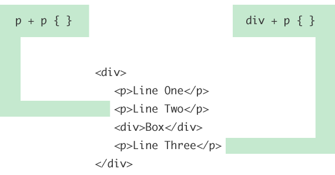

#Child and Sibling Selectors

Do you know what the difference between these selectors are?

```
ul li { margin: 0 0 5px 0; }
ul > li { margin: 0 0 5px 0; }
```
In both cases, they are selecting list items that are children of unordered lists. But there is a difference between [children](https://css-tricks.com/almanac/selectors/c/child/) and [descendants](https://css-tricks.com/almanac/selectors/d/descendant/).

The first selector above is a *decendant* selector. It will select any list items that are anywhere underneath an unordered list in the markup structure. The list item could be buried three levels deep within other nested lists, and this selector will still match it. The second selector above is a *child combinator* selector. This means it will only select list items that are direct children of an unordered list. In otherwords, it only looks *one level* down the markup structure, no deeper. So if there was another unordered list nested deeper, the list item children of it will not be targeted by this selector.

I think everyone understands the basic decendent selector, but let's do a quick overview of the other selectors in this style: the **child combinator**, the **adjacent sibling combinator**, and the **general sibling combinator**.

###Child combinator

This one we covered in the intro to this article. Let's drive that same example home with a visual:


I think the nested list is a perfect example of why this selector is useful. It can be thought of as a way to prevent styling from cascading down further than you would like it to. Maybe you want to make the outer-most list items large and header-like, but the nested lists smaller and more body-copy like. Using a child combinator you can select only those top level list items and not worry about the large/header styling cascading down to the nested lists and having to fight against that styling.

###Adjecent sibling combinator

An [adjacent sibling](https://css-tricks.com/almanac/selectors/a/adjacent-sibling/) combinator selector allows you to select an element that is directly after another specific element.

```
p + p { font-size: smaller; } /* Selects all paragraphs that follow another paragraph */
#title + ul { margin-top: 0; } /* Selects an unordered list that directly follows the element with ID title */
```

Hopefully helpful graphic:



###General sibling combinator

The general sibling combinator selector is very similar to the adjacent sibling combinator selector we just looked at. The difference is that the element being selected *doesn't need to immediately succeed* the first element, but can appear anywhere after it.

If we use the same example structure as above, the last \<p> element will be selected by p ~ p as well, because it is preceded by another \<p> element, even though not *directly*.


Note that in both the general sibling and adjacent sibling selectors the logic takes place within the same parent element. That's what siblings means... sharing the same parent. In the graphical examples above, that's what the wrapping \<div> is there for. If there was another \<p> element after that \<div>, it would still be selected by both div ~ p and div + p though, as it would be a sibling and an adjacent sibling to that \<div>.

#Resources

[W3C css3 selectors](https://www.w3.org/TR/css3-selectors/#selectors)

[children](https://css-tricks.com/almanac/selectors/c/child/)

[descendants](https://css-tricks.com/almanac/selectors/d/descendant/)

[adjacent sibling](https://css-tricks.com/almanac/selectors/a/adjacent-sibling/)
