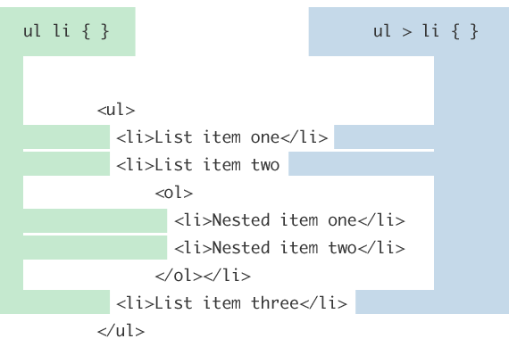
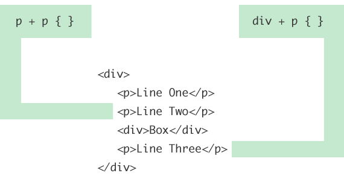
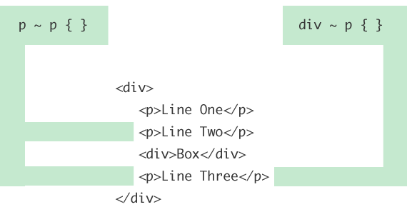
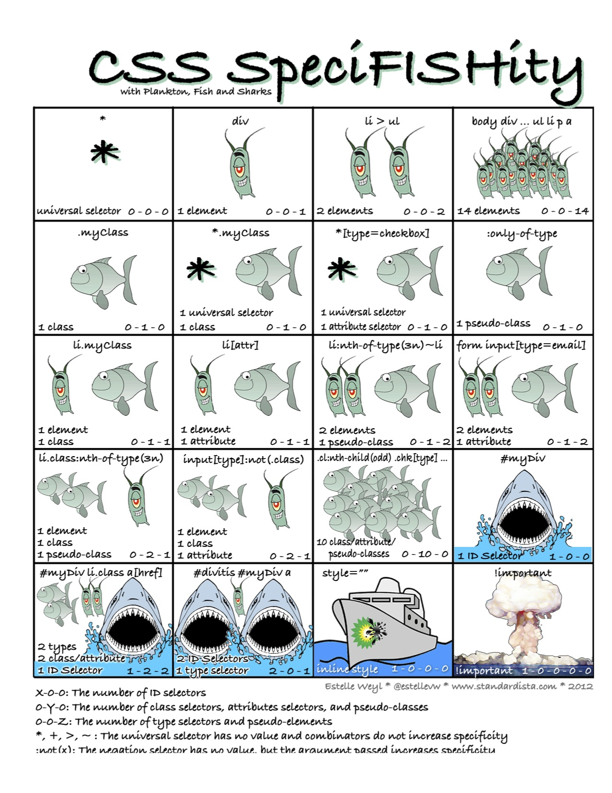
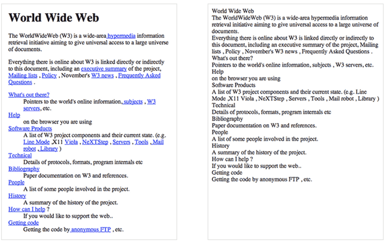

# CSS and Sass 

This talk will discuss basic topics in css and move into a discussion on Sass.
Some topics discussed wil be...

 - PART-1: Selectors and Basic styling

 - PART-2: Child and Sibling Selectors

 - PART-3: Specificity and Normalization

 - PART-4: SASS

##CSS PART-1: Selectors and Basic styling

###Learning Objectives:

by the end of this section you will be able to...

- Match CSS selectors to DOM elements
- Style a page's fonts and background colors with CSS
        - font families
        - weights and decoration
        - colors (words, hex, rgba)
- Demonstrate knowledge of the box model by styling the padding, border, and margin of a basic div

###CSS Selectors

CSS selectors allow you to select and manipulate HTML element(s).

CSS selectors are used to "find" (or select) HTML elements based on their id, classes, types, attributes and values of attributes.

###The element Selector
The element selector selects elements based on the element name.

You can select all `<p>` elements on a page like this: (all `<p>` elements will be center-aligned, with a red text color)

**example**

```
p {
    text-align: center;
    color: red;
}
```

###The id Selector

The id selector uses the id attribute of an HTML tag to find the specific element.

An id should be unique within a page, so you should use the id selector when you want to find a single, unique element.

To find an element with a specific id, write a hash character, followed by the id of the element.

The style rule below will be applied to the HTML element with id="content":

```
#content {
    text-align: center;
    color: red;
}
```
###The class Selector

The class selector finds elements with the specific class.

The class selector uses the HTML class attribute.

To find elements with a specific class, write a period character, followed by the name of the class:

In the example below, all HTML elements with class="center" will be center-aligned and given a color of red:

Example

```
.center {
    text-align: center;
    color: red;
}
```

You can also specify that only specific HTML elements should be affected by a class.

In the example below, all `p` elements with class="center" will be center-aligned:

```
p.center {
    text-align: center;
    color: red;
}
```


let's look at the Lesson files, create a new space on the Desktop....

	cd ~/Desktop

	mkdir basicpage
	
open the lesson1_files folder in a text editor. You should see this file structure...
	
```
├── another-page.html
├── css
│   └── stylesheet.css
├── image
│   └── fish.jpg
└── basicpage.html
```
let's open our main basicpage.html page...

**basicpage.html**

```
<!doctype html>
<html>
	<head>
	    <title>basic css and html - part2</title>
	    <!-- <link type="text/css" rel="stylesheet" href="css/stylesheet.css" /> -->
	</head>
	<body>
		
		
		<div id="content">
			Hi, I'm just some text inside the main "content" div.
		    <div class="article">
				<h3 class="article_header">News: Nemo finds slipsum!</h3>
				<p class="article_paragraph">
					
					Well, the way they make shows is, they make one show. That show's called a pilot. Then they show that show to the people who make shows, and on the strength of that one show they decide if they're going to make more shows. Some pilots get picked and become television programs. Some don't, become nothing. She starred in one of the ones that became nothing.  
					<br>
					<a href="another-page.html">Go to another-page.html</a>
				</p>
		    </div>
		</div>

		
	</body>
</html>
```

where going to take a look at the provided css stylesheet as well...

**stylesheet.css**

```
#content{
	height:200px;
	width:800px;
}

.article {
	padding: 20px;
	margin-top: 20px;
	margin-bottom: 20px;
	height:100%;
	background-color:silver;
	border-radius: 10px;
}

.article_header {
	font-size: large;
	font-family: sans-serif;
	font-weight: bold;
	margin-bottom: 10px;
}

.article_paragraph {
	
}

.article_image {
	width: 100px;
	height: 100px;
	float:left;
	border:1px dotted black;
	margin:0px 15px 0px 0px;
}

.section {
	height:100%;
	width:50%;
	text-align: center;
	background-color:green;
	border-radius: 10px;	
}


.float_left {
	float: left;
}

.float_right {
	float: right;
}

.clear_both {
	clear:both;
}
html {
	display: table;
	margin:auto;
}

body {
	display: table-cell;
	vertical-align: middle;
}

```

Note that an image file has also been provided into the same folder...


Now we are going to play with the code in both files to get a better understanding of: 

- How to connect css to your html document
- play with id and class
- change html elements via css code

let's start by changing this...

	<!-- <link type="text/css" rel="stylesheet" href="stylesheet.css" /> -->

to this...

	<link type="text/css" rel="stylesheet" href="stylesheet.css" />

NOTE: Change various elements in the stylesheet.css file and see how it changes the basicpage.html file. Explore what this means for class and id selectors.


Now let us talk about BOX MODEL

Every element is a rectangular box, and there are several properties that determine the size of that box. 

Each part of the box model corresponds to a CSS property: `width`, `height`, `padding`, `border`, and `margin`.


###Box Model


Explore the fishy on our page via the Chrome inspector magnify lens...compare that to the code in our html and css files.

Let's play here and see what things do.

```
	<div>
		<div id="box" class="border-solid">2px <br> solid</div>

		<div id="box" class="border-double">6px <br> double</div>

		<div id="box" class="border-dashed">8px <br> dashed</div>
	</div>
```


###Display

Exactly how elements are displayed is determined by the display property.

There are quite a few values for the display property, but the most common are block, inline, inline-block, and none.

let's play in our **stylsheet.css**

```
	#box {
		display: inline-block;
	}
	
	p{
		display: block;
	}
```

###Inline vs. block-level
**Content model**

	Generally, inline elements may contain only data and 
	other inline elements.

**Formatting**

	By default, inline elements do not begin with a new line.
	They line up side by side.
	
###Block-level vs. inline
**Formatting**

	By default, block-level elements begin on a new line. 
	They can be stacked.
	

**Content model**

	Generally, block-level elements may contain inline elements and
	other block-level elements. Inherent in this structural distinction 
	is the idea that block elements create "larger" structures than 
	inline elements.

###Part1 - resources:
[html glossary](http://www.codecademy.com/glossary/html)

[css selectors](http://www.w3schools.com/css/)

[HTML Block-level elements](https://developer.mozilla.org/en-US/docs/Web/HTML/Block-level_elements)

[HTML Inline elements](https://developer.mozilla.org/en-US/docs/Web/HTML/Inline_elemente)

[opacity in css - rgba](http://www.css3.info/introduction-opacity-rgba/)

[css gradients](http://www.css3files.com/gradient/?)

**ID Selector controversy**

[Against](http://screwlewse.com/2010/07/dont-use-id-selectors-in-css/)

[For](https://2002-2012.mattwilcox.net/archive/entry/id/1054/) note: read the responses on this post page toward the bottom.

Note: I would invite you the student to read carefully both the pro and against positions. As a learner you must first learn the tools ...as a you journey to becoming a master you learn WHEN to break them. Choose your own speed on this path :)


###( end PART 1 - next up ...)


#Child and Sibling Selectors

Do you know what the difference between these selectors are? Having a good understanding of child and sibling selectors can greatly help when Refactoring you css code as well.

```
ul li { margin: 0 0 5px 0; }
ul > li { margin: 0 0 5px 0; }
```
In both cases, they are selecting list items that are children of unordered lists. But there is a difference between [children](https://css-tricks.com/almanac/selectors/c/child/) and [descendants](https://css-tricks.com/almanac/selectors/d/descendant/).

The first selector above is a *decendant* selector. It will select any list items that are anywhere underneath an unordered list in the markup structure. The list item could be buried three levels deep within other nested lists, and this selector will still match it. The second selector above is a *child combinator* selector. This means it will only select list items that are direct children of an unordered list. In otherwords, it only looks *one level* down the markup structure, no deeper. So if there was another unordered list nested deeper, the list item children of it will not be targeted by this selector.

I think everyone understands the basic decendent selector, but let's do a quick overview of the other selectors in this style: the **child combinator**, the **adjacent sibling combinator**, and the **general sibling combinator**.

###Child combinator

This one we covered in the intro to this section. Let's drive that same example home with a visual:



I think the nested list is a perfect example of why this selector is useful. It can be thought of as a way to prevent styling from cascading down further than you would like it to. Maybe you want to make the outer-most list items large and header-like, but the nested lists smaller and more body-copy like. Using a child combinator you can select only those top level list items and not worry about the large/header styling cascading down to the nested lists and having to fight against that styling.

###Adjecent sibling combinator

An [adjacent sibling](https://css-tricks.com/almanac/selectors/a/adjacent-sibling/) combinator selector allows you to select an element that is directly after another specific element.

```
p + p { font-size: smaller; } /* Selects all paragraphs that follow another paragraph */
#title + ul { margin-top: 0; } /* Selects an unordered list that directly follows the element with ID title */
```

Hopefully helpful graphic:



###General sibling combinator

The general sibling combinator selector is very similar to the adjacent sibling combinator selector we just looked at. The difference is that the element being selected *doesn't need to immediately succeed* the first element, but can appear anywhere after it.

If we use the same example structure as above, the last \<p> element will be selected by p ~ p as well, because it is preceded by another \<p> element, even though not *directly*.



Note that in both the general sibling and adjacent sibling selectors the logic takes place within the same parent element. That's what siblings means... sharing the same parent. In the graphical examples above, that's what the wrapping \<div> is there for. If there was another \<p> element after that \<div>, it would still be selected by both div ~ p and div + p though, as it would be a sibling and an adjacent sibling to that \<div>.

#Resources

- [W3C css3 selectors](https://www.w3.org/TR/css3-selectors/#selectors)

- [children](https://css-tricks.com/almanac/selectors/c/child/)

- [descendants](https://css-tricks.com/almanac/selectors/d/descendant/)

- [adjacent sibling](https://css-tricks.com/almanac/selectors/a/adjacent-sibling/)


###( end PART 2 - next up ...)


#Specificity and Normalization


##Specificity

If you have two (or more) conflicting CSS rules that point to the same element, there are some basic rules that a browser follows to determine which one is most **specific** and therefore wins out. Thus, Specificity determines, which CSS rule a browser applies.


###Specificity hierarchy
Every selector has its place in the specificity hierarchy. There are five distinct categories which define the specificity level of a given selector. They are listed here in order of precedence:

1. **!important:** Any property declaration with the term !important takes highest precedence, even over inline styles. If !important is declared more than once on conflicting properties targeting the same element, you CSS author be shot, and the other precedence rules are in effect. It’s as if the weight of the selector with the !important declaration were 1-X-A-B-C, for that property only (where A, B and C are the actual values of the parent selector as described below). Because of this, important should not be used, but can be handy in debugging.

2. **style="":**  Inline styles (Presence of style in HTML document).
An inline style lives within your HTML document. It is attached directly to the element to be styled. E.g. \<h1 style="color: #fff;">. The weight of style="" is 1-0-0-0.

3. **id:** (# of ID selectors)
ID is an identifier for your page elements, such as #div. The weight of an id selector is 1-0-0 per id.

4. **Class, attribute and pseudo-class:** (# of class selectors).
This group includes .classes, [attributes] and pseudo-classes such as :hover, :focus etc, have the same weight of 0-1-0.

5. **type:** Elements and pseudo-elements (# of Element (type) selectors).
Including for instance :before and :after. These have the lowest value in terms of specificity with 0-0-1 per element.

If more than one selector have the same specificity, then adhere to the cascade: the last declared rule takes precedence.

###CSS Specificity Tools & Resources

It may not seem like something that important, and in most cases you won’t come across any conflicts at all, but the larger and more complex your CSS files become, or the more CSS files you start to juggle with, the greater likelihood there is of conflicts turning up.

Here are some resorces that can help. Let's explore them...

[HTMLdog - Specificity Tutorial](http://www.htmldog.com/guides/css/intermediate/specificity/)

[Visual Specificity Calculator](http://specificity.keegan.st/)


##Exercise
Some people are confused by CSS Specificity, especially with all of the (not-so) new CSS3 Selectors. So let's take a look at one more resource  I think can help illuminate things...

Let us have some fish explain this to us.

[SpeciFISHity](specifishity1.pdf)



##Normalize.css

In case you didn’t know, every browser has its own default stylesheet that it uses to make unstyled websites appear more legible. For example, most browsers, by default, make links blue and visited links purple, give tables a certain amount of border and padding, apply variable font-sizes to H1, H2, H3 etc. and a certain amount of padding to almost everything. Ever wondered why Submit buttons look different in every browser?

####Basic Example: CSS Reset vs. No CSS Reset

Here’s [the first website ever created](http://www.w3.org/History/19921103-hypertext/hypertext/WWW/TheProject.html), with and without a CSS Reset:



For a looooong time one of the best tools for doing this out there on the web was [Eric Meyer's reset.css](http://meyerweb.com/eric/tools/css/reset/). However, like with all thing "web" this has since shifted. Since the advent of HTML5 and CSS3 the current leader in this technique is [Normaliz.css](http://necolas.github.io/normalize.css/) by Nicolas Gallagher. 

What's the difference between normalize.css and reset.css?

1. Normalize.css preserves useful defaults rather than "unstyling" everything. For example, elements like `sup` or `sub` "just work" after including normalize.css (and are actually made more robust) whereas they are visually indistinguishable from normal text after including reset.css. So, normalize.css does not impose a visual starting point (homogeny) upon you. This may not be to everyone's taste. The best thing to do is experiment with both and see which gels with your preferences.

2. Normalize.css corrects some common bugs that are out of scope for reset.css. It has a wider scope than reset.css, and also provides bug fixes for common problems like: display settings for HTML5 elements, the lack of `font` inheritance by form elements, correcting font-size rendering for pre, SVG overflow in IE9, and the `button` styling bug in iOS.

3. Normalize.css doesn't clutter your dev tools. A common irritation when using reset.css is the large inheritance chain that is displayed in browser CSS debugging tools. This is not such an issue with normalize.css because of the targeted stylings.

4. Normalize.css is more modular. The project is broken down into relatively independent sections, making it easy for you to potentially remove sections (like the form normalizations) if you know they will never be needed by your website.

5. Normalize.css has better documentation. The normalize.css code is documented inline as well as more comprehensively in the [GitHub Wiki](https://github.com/necolas/normalize.css/wiki). This means you can find out what each line of code is doing, why it was included, what the differences are between browsers, and more easily run your own tests. The project aims to help educate people on how browsers render elements by default, and make it easier for them to be involved in submitting improvements.

Greater detail about this can be found in the article [about normalize.css](http://nicolasgallagher.com/about-normalize-css/).

##Resources for Normalize.css:
[The Normalize.css page](http://necolas.github.io/normalize.css/)

The current king of resets...Normailze.css

[Meyerweb.com - Eric Meyer's css reset](http://meyerweb.com/eric/tools/css/reset/)

Take a peek at the former king of css resets

(keep your eyes peeled, with all things web, who is on top could change next week)

##Exercise

Let's look at the first ever web page and link normalize.css to it...and see what happens. (note: first\_ever\_web\_page.htm and normaize.css are included in this repo, I will open this up in my editor.)

###( end PART 3 - next up ...)

## Sass

Sass is a css preprocessor. Sass lets you use features that don't exist in CSS yet like variables, nesting, mixins, inheritance and other nifty goodies that make writing CSS fun. Here is a list of abilities we will quickly review...

- Variables
- Nesting
- Partials
- Import
- Mixins
- Inheritance
- Operators

First up...

###Variables

```
$font-stack:    Helvetica, sans-serif;
$primary-color: #333;

body {
  font: 100% $font-stack;
  color: $primary-color;
}
```


```
body {
  font: 100% Helvetica, sans-serif;
  color: #333;
}
```

###Partials and Import

Partial Sass files contain little snippets of CSS that you include in other Sass files.Sass partials are used with the @import directive.

**Partial**

```
_partial.scss
```

**Import**

Let's say you have a couple of Sass files, _reset.scss and base.scss. We want to import _reset.scss into base.scss.

```
// _reset.scss

html,
body,
ul,
ol {
   margin: 0;
  padding: 0;
}
```

```
/* base.scss */

@import 'reset';

body {
  font-size: 100% Helvetica, sans-serif;
  background-color: #efefef;
}
```
###Nesting & Inheritance

Nesting is awesome (but can also be tricky if you haven't planned out your stylesheet, so map out your page structure first!).

You can nest rules inside of each other. If you have an ```<a>``` inside of a ```<nav>```, and you want those a's specially styled, you can do this:

```
nav {
	background-color: #ff3366;
	
	a {
		text-decoration: none;
		font-weight: bold;
	}

}
```

You can also use ```@extend``` to re-apply rules across selectors (inheritance!). 

**generic rule:**

```
.box {
	height: 100px;
	width: 100px;
}
```

**inherited elsewhere:**

```
.blue { 
	@extend .box;
	background-color: blue;
}

.green { 
	@extend .box;
	background-color: green;
}
```

###Mixins

Mixins are like functions for sass

```
@mixin border-radius($radius) {
  -webkit-border-radius: $radius;
     -moz-border-radius: $radius;
      -ms-border-radius: $radius;
          border-radius: $radius;
}

.box { @include border-radius(10px); }
```

###Operators

You can create flexible layouts (fluid grids!) by embedding the math for sizing directly in your stylesheets.

```
 section {
 	width: 500px / 960px * 100%;
 	}
 	
```

In the above rule, the section will be 500px wide if the window is 960px wide, or **500/960 px** wide for other window widths.


###Fun facts

- The official SASS guide is [here](http://sass-lang.com/quide).
- ```@import``` lets you bring in other sheets (like the base stylesheet that comes with Twitter Bootstrap) or partials.
- You can also use conditionals, like ```@if``` to set styles.
- Additional operators (like ```&```) take things next-level, and let you select parent or child selectors.
- Bootstrap and other front-end frameworks support SASS.
- If you love SASS and want to use it on a non-standard framework app, you can! [Compass](http://compass-style.org/) is your pal.

**source:**

[the sass guide](http://sass-lang.com/guide)

If you wanna go down the rabbit hole check out the reference

[sass reference](http://sass-lang.com/documentation/file.SASS_REFERENCE.html)

#Demo App - Sassy

Example of an app using sass.

###Build Sassy Art

Now we can do a code demo for sass with the sassy-art files folder in this directory.

This is a super simple sample Rails app (limited functionality -- Index action only) designed for this SASS talk.

(Time permiting) As a group, we'll use SASS to style the app together and highlight some of the things that can be done.


#Project examples

Now let's explore sass in one of our projects. And discuss the architecture used to employ sass.

Open these files...

_channelpage.scss

_scheme.scss

sonicbox/css/_colors.scss

common/css/_colors.scss

NOTE: use of command+leftClick on @import to burrow down to find actual colors

GOLDEN RULE: when needing to add colors, change the associated interface (_scheme)

###( end PART 4 - next up ...)


### Further interesting reading
- [OOCSS, ACSS, BEM, SMACSS](http://clubmate.fi/oocss-acss-bem-smacss-what-are-they-what-should-i-use/)
- [PostCSS](http://postcss.org)

<br>
<br>


(This content compiled and edited by Alfonso Rush)